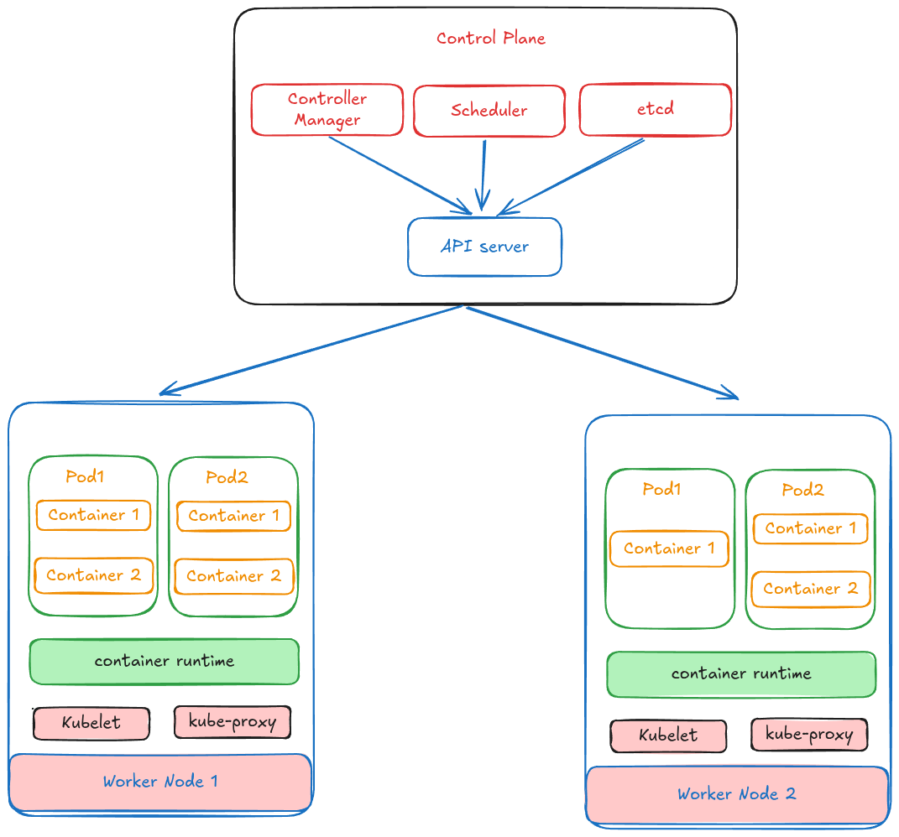

# Kubernetes

## What is Kubernetes aka k8s

Kubernetes is a portable, extensible, open source platform for managing containerized workloads and services, that facilitates both declarative configuration and automation. It has a large, rapidly growing ecosystem. Kubernetes services, support, and tools are widely available.

# Key components


##

### Core Components

A Kubernetes cluster consists of a control plane and one or more worker nodes. Here's a brief overview of the main components:

### Control Plane Components (responsible for managing the state of the cluster)

Manage the overall state of the cluster:

##
##### kube-apiserver
 The core component server that exposes the Kubernetes HTTP API.

##
##### etcd (it's a database)
Consistent and highly-available key value store for all API server data.

##
##### kube-scheduler
Looks for Pods not yet bound to a node, and assigns each Pod to a suitable node.

##
##### kube-controller-manager
runs controllers that are responsible to manage the state of the cluster 
###### example: replication controller insures that desired number of replicas of a pod are running
``` json
spec:
    replicas: 4
```

##
##### cloud-controller-manager (optional)
Integrates with underlying cloud provider(s).


### Node Components
#### nodes are used to run containerized applications called (pods), these pods are the smallest deployable unit in k8s
Run on every node, maintaining running pods and providing the Kubernetes runtime environment:




* kubelet
##### Is a daemon that runs on each worker node, it's responsible for communicating with the control plane
##### Ensures that Pods are running, including their containers.

* kube-proxy (optional)
##### Maintains network rules on nodes to implement Services.

* Container runtime
##### Software responsible for running containers (pulls image, starting and stoping containers).
